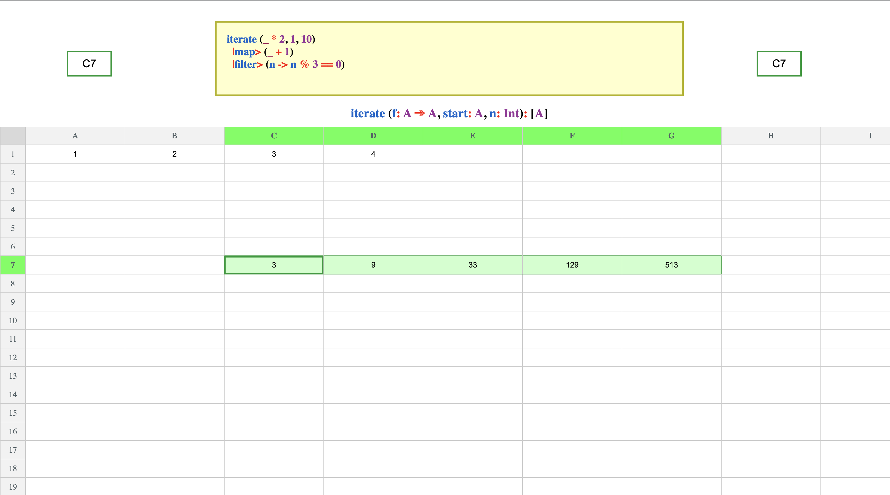

# puresheet

## Description

Spreadsheet management application implemented on [Halogen](https://github.com/purescript-halogen/purescript-halogen) 
aiming to provide an extensible, expressive and simple to use platform
for data representation, visualization, analysis and exploration available
for use for enterprise, personal & educational purposes.

## Project Goals

- [✔️] Provide a no frills, minimalistic GUI supporting all basic spreadsheet functionality regarding navigation, cell management, formula evaluation & automatic cell updates.

- [✔️] Develop a high level pure functional dynamic formula language interpreted at the browser, that supports currying, patterns and guards with expresiveness similar to the term level language in Haskell or Purescript, albeit with familiar syntax and idioms to popular spreadsheet applications and mainstream languages.

- [✔️] Implement a prelude library with commonly used functions and combinators, loaded at startup.

- [✔️] Support formula edition with syntax highlighting and function signatures for the current function at the cursor.

- [✔️] Support IDE like autocomplete for imported and module aliased top-level functions and operators.

- [✔️] Expose an Explorer view to query by function name, signature or a input / output example (in a similar fashion to Hoogle / Pursuit) and see global functions & operators along with their documentation on a per module basis.

- [✔️] Support Go to documentation on the formula editor for modules, functions & operators.

- [✔️] Persist user defined formulas, spreadsheet data, functions & operators in the browser local storage.

- Format automatically formulas when evaluated.

- Add the capability for a user to create, modify or delete global functions & operators through an auxiliary modal in the Explorer view.

- Enable the use of formulas for filtering & sorting rows.

- Support Import & Export of spreadsheets from and to Excel and Google Sheets with the proper mapping of cell values & formulas.

- Support authenticated persistence & retrieval from a catalog of private spreadsheets via a future backend.


## Screenshots



## Keybindings

#### General

<center>

| Key Combination | Action |
| --------------- | ------ |
| `Control` + `J` | Next view |
| `Control` + `K` | Previous view |

</center>


#### Spreadsheet table

<center>

| Key Combination | Action |
| --------------- | ------ |
| &uarr; &darr; &larr; &rarr; | Cell navigation |
| `h` `j` `k` `l` | Cell navigation (Vim like) |
| `Shift` + &uarr; &darr; &larr; &rarr; | Cell selection |
| `Shift` + `Hover` | Cell selection |
| `Tab` | Go to next cell |
| `Shift` + `Tab` | Go to previous cell |
| `Enter` | Edit cell value |
| `Control` + `Enter` | Edit formula |
| `Backspace` | Delete cell/s |
| `Control` + `G` | Go to cell |
| `Control` + `A` | Select all cells |
| `Control` + `C` | Copy cell/s |
| `Control` + `V` | Paste cell/s |
| `Control` + `X` | Cut cell/s |

</center>

#### Formula Editor

<center>

| Key Combination | Action |
| --------------- | ------ |
| `Tab` | Switch out of editor |
| `Control` + `Enter` | Submit formula |
| `Enter` | Autocomplete with current suggestion
| &uarr; | Previous autocomplete suggestion |
| &darr; | Next autocomplete suggestion |
| `Shift` + `Tab` | Previous autocomplete suggestion |
| `Tab`  | Next autocomplete suggestion |
| `Control` + `Click`  | Go to function / module documentation |
| `Control` + `D`  | Go to function / module documentation |

</center>

#### Function Explorer

<center>

| Key Combination | Action |
| --------------- | ------ |
| `Control` + `M` | Switch module |
| `Control` + `F` | Search for function |
| &uarr; &darr; | Previous / next function |
| `Shift` + `Tab` `Tab`  | Previous / next function |

</center>

Note: `Control` bindings also match the `Command` key on Mac OS.


## Local Deployment

First, clone the repository:

```console
$ git clone https://github.com/albertprz/puresheet
$ cd puresheet
```

Then, install the necessary dependencies via `npm`:

```console
$ npm install
```

Finally build the project and launch it in localhost:


```console
$ npm run build
$ npm run serve
```
    
